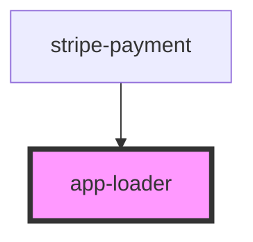

# app-loader

<!-- Auto Generated Below -->

## Properties

| Property | Attribute | Description | Type     | Default            |
| -------- | --------- | ----------- | -------- | ------------------ |
| `color`  | `color`   |             | `string` | `'var(--primary)'` |
| `height` | `height`  |             | `number` | `60`               |

## Dependencies

### Used by

 - [stripe-payment](../full-widget/stripe-element)

### Graph

----------------------------------------------

*Built with [StencilJS](https://stenciljs.com/)*
