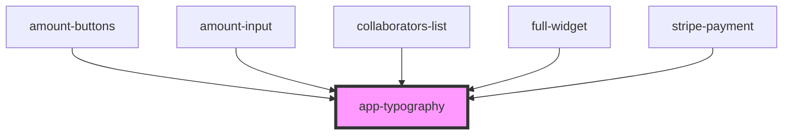

# app-typography

<!-- Auto Generated Below -->

## Properties

| Property     | Attribute     | Description | Type                                                                                          | Default     |
| ------------ | ------------- | ----------- | --------------------------------------------------------------------------------------------- | ----------- |
| `fontFamily` | `font-family` |             | `string`                                                                                      | `'inherit'` |
| `styleProps` | --            |             | `{}`                                                                                          | `{}`        |
| `variant`    | `variant`     |             | `"body1" \| "h1" \| "h2" \| "h3" \| "secondaryCaption" \| "secondaryMessage" \| "secondaryP"` | `undefined` |

## Dependencies

### Used by

 - [amount-buttons](../full-widget/select-amount/amount-buttons)
 - [amount-input](../full-widget/select-amount/amount-input)
 - [collaborators-list](../full-widget/collaborators-list)
 - [full-widget](../full-widget)
 - [stripe-payment](../full-widget/stripe-element)

### Graph

----------------------------------------------

*Built with [StencilJS](https://stenciljs.com/)*
