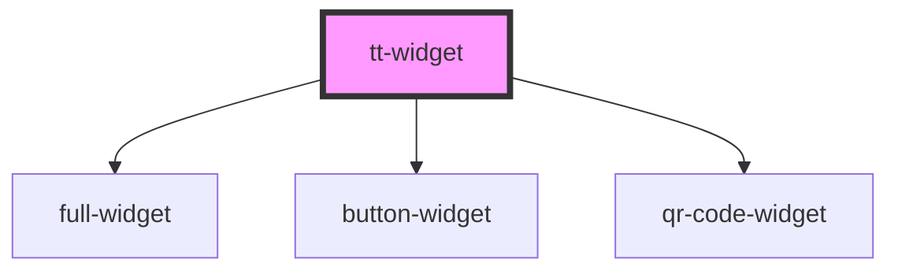

# tt-widget

<!-- Auto Generated Below -->

## Properties

| Property   | Attribute  | Description | Type     | Default     |
| ---------- | ---------- | ----------- | -------- | ----------- |
| `language` | `language` |             | `string` | `'en'`      |
| `wId`      | `w-id`     |             | `string` | `undefined` |

## Dependencies

### Depends on

- [full-widget](../full-widget)
- [button-widget](../button-widget)
- [qr-code-widget](../qr-code-widget)

### Graph

----------------------------------------------

*Built with [StencilJS](https://stenciljs.com/)*
